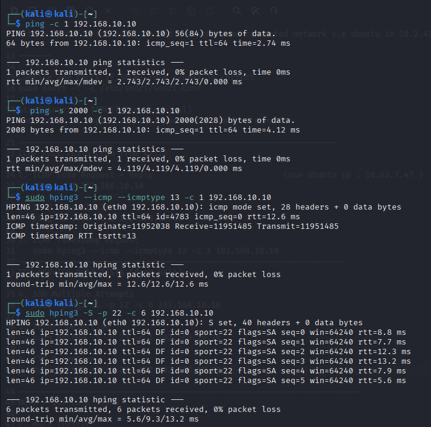
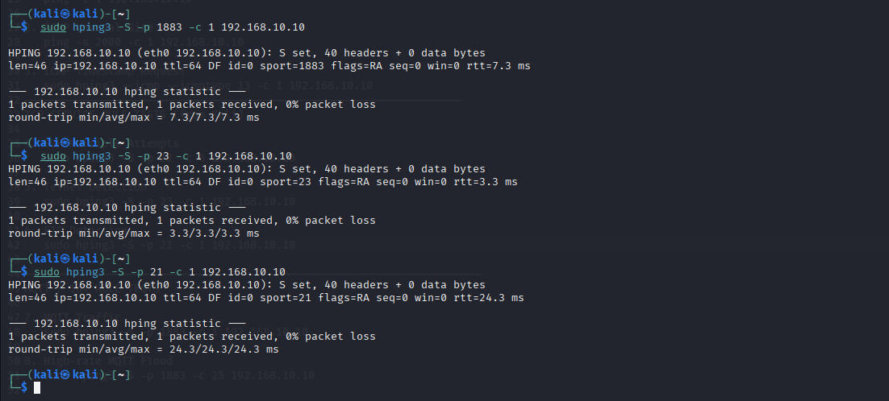
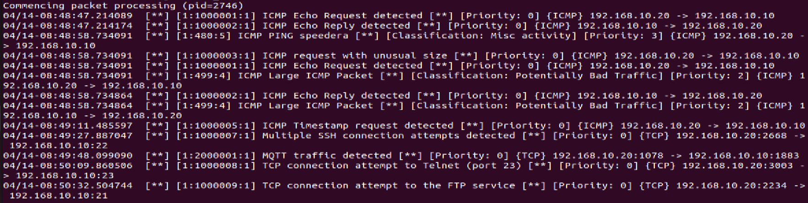
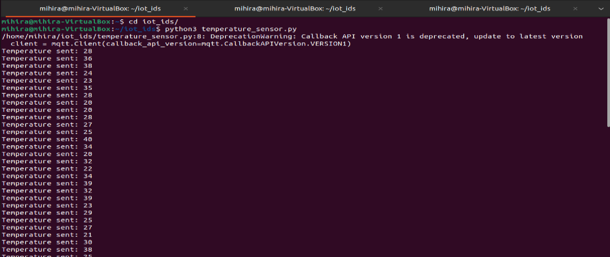
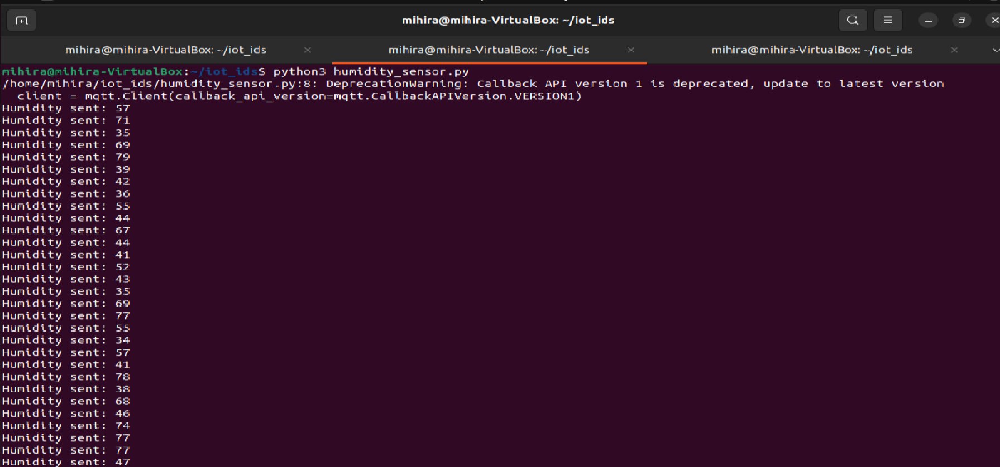

# Lightweight Distributed IoT Intrusion Detection System

## Overview
This project implements a lightweight, distributed Intrusion Detection System (IDS) for IoT environments using a hybrid approach that combines signature-based detection with behavioural analysis.
It combines **network-level detection (Snort)** and **device-level anomaly detection (Python)** to identify both known attacks and abnormal behavior in real time.

The system simulates IoT communication using the MQTT protocol and monitors both traffic patterns and sensor data to improve detection accuracy while maintaining low resource usage.


## Problem Statement
IoT devices operate with limited memory, processing power, and energy, making it difficult to deploy traditional security mechanisms. 
Existing IDS solutions are either:
- Too resource-intensive (e.g., Snort in full-scale environments)
- Limited to detecting only known attacks
- Not optimized for MQTT-based IoT communication

This project addresses these challenges by designing a **lightweight and hybrid IDS** capable of detecting both network intrusions and behavioral anomalies efficiently.


## System Architecture
The system follows a distributed and modular architecture:

- **IoT Sensor Nodes (Python)** → generate temperature & humidity data 
- **MQTT Broker (Mosquitto)** → handles communication 
- **Snort IDS** → monitors network traffic and detects rule-based attacks
- **Anomaly Detection Module (Python)** → analyzes sensor behavior 
- **Alert Correlation** → combines both results for better accuracy 

The complete workflow includes:
1. Sensor data generation 
2. MQTT message transmission 
3. Network traffic monitoring 
4. Rule-based detection using Snort 
5. Behavior analysis using Python 
6. Alert generation


## Key Features

### Network-Level Detection (Snort)
- ICMP attack detection (echo, unusual size, timestamp)
- TCP-based attack detection:
  - SSH brute-force attempts 
  - Telnet access 
  - FTP traffic 
- MQTT traffic monitoring
- Detection based on custom Snort rules

### Behaviour-Based Detection (Python)
- Threshold-based detection 
- Sudden change detection 
- Moving average deviation detection 

### Hybrid Detection Advantage
- Detects both **known attacks (rules)** and **unknown anomalies (behavior)**


## Technologies Used

- **Snort** – Network intrusion detection 
- **Python** – Sensor simulation & anomaly detection 
- **MQTT (Mosquitto)** – IoT communication protocol 
- **paho-mqtt** – MQTT client library 
- **Ubuntu / Kali Linux** – Testing environment (Kali - attacker, Ubuntu - victim)
- **Oracle VirtualBox** – To install and use Ubuntu and Kali VMs


## Project Structure

```
iot_ids/
│
├── scripts/
│   ├── temperature_sensor.py
│   ├── humidity_sensor.py
│   └── ids_monitor.py
│
├── rules/
│   └── snort.rules
│
├── attacks/
│   └── commands.txt
│
├── screenshots/
│   ├── kali_attacks1.png
│   ├── kali_attacks2.png
│   ├── python_humidity_output.png
│   ├── python_temperature_output.png
│   ├── python_ids_anomaly_detection.png
│   ├── snort_detection_output.png
│   └── snort_test_output.png
│
└── README.md
```


## Implementation Details

### 1. Data Acquisition
Python scripts simulate IoT sensors and publish temperature and humidity data using MQTT topics.

### 2. Communication
MQTT broker (Mosquitto) enables publish–subscribe communication between sensors and IDS.

### 3. Network Monitoring
Snort captures and analyzes traffic between IoT devices and broker using predefined rules.

### 4. Behaviour Analysis
Python module detects anomalies using:
- Threshold limits 
- Sudden variation detection 
- Deviation from normal patterns

### 5. Alert Correlation
Alerts from Snort and anomaly detection are analyzed together to improve detection accuracy. 
(Currently performed manually.)


## Testing & Results

The system was validated using simulated attack scenarios to evaluate both network-level detection and behavioural anomaly detection.

### Attack Simulation (Kali Linux)

Network attacks were generated from a Kali Linux environment using tools such as `ping` and `hping3` to replicate real-world intrusion attempts.




### Network-Level Detection (Snort)

The generated traffic was monitored by Snort IDS. Initial rule validation was performed, followed by real-time detection of malicious activity based on custom rules.



### Behavioural Anomaly Detection (Python)

Sensor data was analyzed using the Python-based module to identify anomalies such as threshold violations, sudden changes, and deviations from normal patterns.





The system successfully detected all simulated attacks and anomalous behaviours, demonstrating the effectiveness of combining rule-based and behavioural analysis in a lightweight IoT IDS.


## Strengths

- Lightweight and suitable for IoT environments 
- Combines rule-based and anomaly-based detection 
- Real-time monitoring and alerting 
- Modular and scalable design 


## Limitations

- Rule-based detection cannot identify all zero-day attacks 
- Alert correlation is manual (not automated yet) 
- Limited to simulated IoT environment 


## Future Improvements

- Automate alert correlation 
- Add real-time monitoring dashboard 
- Extend to multiple IoT devices 
- Integrate cloud-based logging and analysis 
- Implement automated response (blocking malicious traffic)


## Author
Mihira Seru
GitHub: [mihirasheru](https://github.com/mihirasheru)
